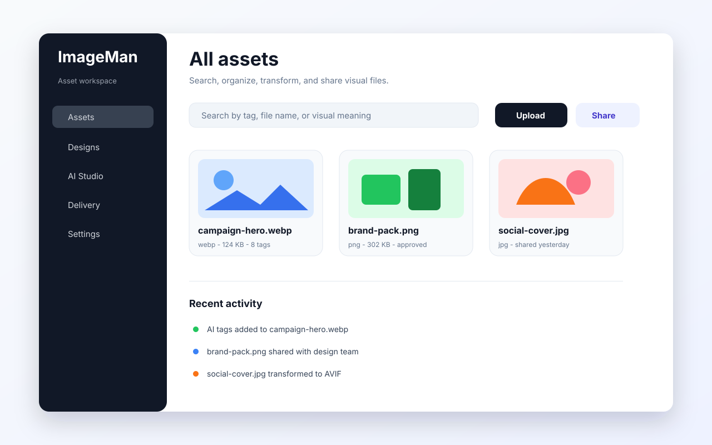

<!-- SPDX-License-Identifier: Apache-2.0 -->
<h1 align="center">img-man</h1>

<p align="center">
  <strong>The open-source media platform you host yourself.</strong><br>
  Asset management, a design studio, PDF tools, AI editing, and a delivery API —
  one Next.js app, your bucket, your AI key, no per-seat pricing.
</p>

<p align="center">
  <a href="#features">Features</a> ·
  <a href="SETUP.md">Setup</a> ·
  <a href="customer-docs/INDEX.md">Documentation</a> ·
  <a href="#embed-it-in-your-own-product">Embed</a> ·
  <a href="CONTRIBUTING.md">Contributing</a>
</p>

<p align="center">
  <a href="https://github.com/img-man/img-man/actions/workflows/ci.yml"></a>
  <a href="https://github.com/img-man/img-man/releases"></a>
  
  
  
</p>

<p align="center">
  
</p>

---

## What it is

Most teams end up paying for four products to handle one problem: a DAM for the
files, Canva for the layouts, a PDF site for the paperwork, and an image CDN for
delivery. img-man is those four things in a single self-hosted application, with
one asset library underneath all of them.

You run it. Files land in **your** cloud bucket. AI calls go to **your**
provider key. There is no hosted tier to graduate into, no storage cap, and no
usage meter — the dashboard shows what you have used, never what you are allowed
to use.

## Quick Start

### From source

```bash
git clone https://github.com/img-man/img-man.git && cd img-man
npm install                            # requires Node.js 22+
cp .env.example .env                   # add a MongoDB URI + storage bucket
npm run dev                            # http://localhost:4000
```

### Docker Compose

App + MongoDB, no manual config — good for trying it out:

```bash
git clone https://github.com/img-man/img-man.git && cd img-man
docker compose up -d --build           # http://localhost:3000
```

First login: `admin@img-man.com` / `Admin@12345` — the app forces you to
replace these before opening the dashboard.

### Docker image

Release images are published to GHCR (and, once the maintainer configures a
Docker Hub namespace, Docker Hub too) with tags `X.Y.Z`, `X.Y`, `X`,
`latest`:

```bash
docker run --rm -p 3000:3000 -e MONGODB_URI="mongodb://host:27017/img-man" \
  -e NEXTAUTH_SECRET="$(openssl rand -base64 32)" \
  ghcr.io/img-man/img-man:latest
```

Availability of `ghcr.io/img-man/img-man:latest` starts with the first
release tag; until then use the Compose path above.

Full walkthrough: **[SETUP.md](SETUP.md)**.

---

## Trust

- **Open source, Apache-2.0** — the full application, no crippleware, no
  license keys. The [name and logo](TRADEMARK.md) are trademarked
  separately.
- **Self-hosted** — you run it; your database, your bucket, your AI keys.
- **Your data stays yours** — assets go to storage you configure, AI calls
  go to providers you enable with keys you supply.
- **No phone-home** — the application makes no telemetry or
  license-check callbacks, and no license enforcement will be added.
- **Free CI/CD on public infrastructure** — GitHub Actions, GHCR, Docker
  Hub; nothing in this project requires a paid service.

---

## Embed it in your own product

This is the feature img-man is built around.

**Whoever is signed in to your application is who img-man runs as.** Your server
mints a short-lived token naming the current user; the embedded dashboard opens
as that person, with their role and their folder access. Uploads, edits, shares,
and audit entries all carry their name.

Your users never see an img-man login screen, never create an img-man password,
and never appear in a second account list you have to keep in sync.

```js
// Your backend — the API key never reaches the browser
const { accessToken } = await fetch(`${IMAGEMAN_BASE_URL}/api/v1/auth/token`, {
  method: 'POST',
  headers: {
    'Content-Type': 'application/json',
    Authorization: `Bearer ${IMAGEMAN_API_KEY}`,
  },
  body: JSON.stringify({ email: currentUser.email, name: currentUser.name }),
}).then((r) => r.json());
```

```jsx
// Your frontend — the entire client-side integration
<iframe
  src={`${embedUrl}/embed/dashboard?token=${accessToken}`}
  allow="clipboard-write"
/>
```

An email img-man has not seen before is provisioned on its first token with the
default role you choose — no invite step, no onboarding email, no second
directory. Deactivate someone in your app and they simply stop receiving tokens.

Scope the embed to a folder, force light or dark to match your host UI, and
swap the wordmark for your own brand via URL parameters. Details in
[SETUP.md § Connect your application](SETUP.md#7-connect-your-application).

---

## Features

### Asset library
- Folder tree with per-folder access modes, member and group allowlists, and
  cascading permissions
- Bulk upload straight to your bucket via signed URLs, with server-side
  extension blocking
- Automatic thumbnails, EXIF extraction, dominant colours, and perceptual hashes
- Versioning with revert, soft-delete trash with configurable retention
- Metadata, tags, starring, and saved views

### Find things
- **Semantic search** over vector embeddings — describe the shot, not the filename
- **People** — face detection and clustering, with names you assign once
- **Smart albums** — saved rules that stay current as the library grows
- **Duplicates** — perceptual-hash matching with side-by-side review
- **Map** — everything with GPS coordinates, plotted

### Design studio
- Canvas editor built on Fabric: layers, masking, blend modes, rulers, guides
- Templates, brand kits, fonts, and stock photo sources
- Real-time collaboration with presence, plus snapshots and version history
- Pulls directly from the asset library — no export/re-upload loop

### PDF suite
- Merge, split, rotate, compress, encrypt, and watermark
- A real page editor with annotations, redaction, and form filling
- OCR via Tesseract, and conversion in and out of Office formats

### AI (bring your own key)
- Generate and edit images from text, inpaint, expand beyond the canvas
- Background removal, upscaling, denoise, relight, retouch, sky replacement,
  style transfer, smart crop, bokeh
- Auto-tagging, captioning, and face detection — optionally on every upload
- Vertex/Gemini and OpenAI supported; per-feature enable/disable with role gates

### Delivery
- Deterministic, cache-keyed transform URLs (`width`, `height`, `format`, `fit`,
  `quality`)
- Named transforms so clients request `?t=thumb` instead of a parameter soup
- Signed share links with expiry, password, and download limits
- Public galleries, and a bucket-direct or proxied delivery mode per request

### Operations
- Roles (owner/admin/editor/viewer) with per-section access control
- Teams and member groups
- API keys with prefix display, revocation, and last-used tracking
- Audit trail and activity feed
- Analytics for bandwidth, access patterns, and per-asset usage
- Built-in API playground and a documentation browser

### For developers and agents
- REST API under `/api/v1` with CORS allowlists per key
- TypeScript SDK — [`packages/imageman-sdk`](packages/imageman-sdk)
- MCP server so coding agents can drive the library —
  [`packages/imageman-mcp-server`](packages/imageman-mcp-server)
- Health probes at `/api/health/live` and `/api/health/ready`

---

## An open-source alternative to

| Category | Commonly used | What img-man gives you |
| --- | --- | --- |
| Image CDN & transforms | Cloudinary, ImageKit, Filestack | Your bucket, your transform URLs, no bandwidth bill from a vendor |
| DAM & brand ops | Bynder, Brandfolder, Canto | Folder governance, metadata, sharing, audit — self-hosted |
| Design | Canva, Adobe Express | A canvas editor wired directly to your asset library |
| Photo intelligence | Google Photos | Semantic search, faces, duplicates, map — on your own hardware |
| PDF tools | iLovePDF, Smallpdf, Acrobat | PDF operations inside the platform that already holds the files |
| Image AI | remove.bg, Canva AI | The same operations against your own provider key |

---

## Architecture

A single Next.js 16 application. No worker, no queue, no cache tier.

```text
src/app/api/          REST API — /api/* for the dashboard, /api/v1/* for clients
src/app/dashboard/    The full authenticated UI
src/app/embed/        Chromeless token-authenticated embed
src/lib/              Storage, AI providers, permissions, transforms, search
src/models/           Mongoose schemas
packages/             Public SDK and MCP server
customer-docs/        End-user documentation, served in-app at /docs
```

| Concern | Choice |
| --- | --- |
| Runtime | Node.js 22+, Next.js 16, React 19 |
| Database | MongoDB (Mongoose) |
| Storage | Google Cloud Storage |
| Auth | NextAuth — credentials, Google, GitHub |
| Images | sharp |
| AI | Vertex AI / Gemini, OpenAI |

---

## Project status

img-man is the open-source core extracted from a previously closed product. The
application is feature-complete and running in production; this repository is
new, so expect rough edges in packaging and docs rather than in the product.

Issues and pull requests are welcome — start with
[CONTRIBUTING.md](CONTRIBUTING.md) and the
[Code of Conduct](CODE_OF_CONDUCT.md). Security reports go through
[SECURITY.md](SECURITY.md), not the public tracker.

Commercial hosting and white-label support are built on top of this repository
and live outside it. Nothing in img-man phones home, checks a licence, or
degrades without a subscription.

---

## Documentation

| | |
| --- | --- |
| [SETUP.md](SETUP.md) | Install, configure, first login, connect a client |
| [docs/architecture.md](docs/architecture.md) | How the system is built |
| [docs/configuration.md](docs/configuration.md) | Every environment variable |
| [docs/support-matrix.md](docs/support-matrix.md) | Supported Node/DB/Docker/OS versions |
| [docs/upgrading.md](docs/upgrading.md) | Upgrades, backups, rollback |
| [docs/releases.md](docs/releases.md) | Release process and policies |
| [CHANGELOG.md](CHANGELOG.md) | What changed in each version |
| [customer-docs/INDEX.md](customer-docs/INDEX.md) | Full end-user documentation |
| [customer-docs/api-reference.md](customer-docs/api-reference.md) | REST API |
| [customer-docs/self-hosting.md](customer-docs/self-hosting.md) | Production deployment |
| [customer-docs/byoc.md](customer-docs/byoc.md) | Bring-your-own-cloud storage |
| [customer-docs/mcp.md](customer-docs/mcp.md) | MCP server for agents |
| [GOVERNANCE.md](GOVERNANCE.md) | How decisions get made |

---

## License

[Apache-2.0](LICENSE). The img-man name and logo are covered separately —
see [TRADEMARK.md](TRADEMARK.md).
