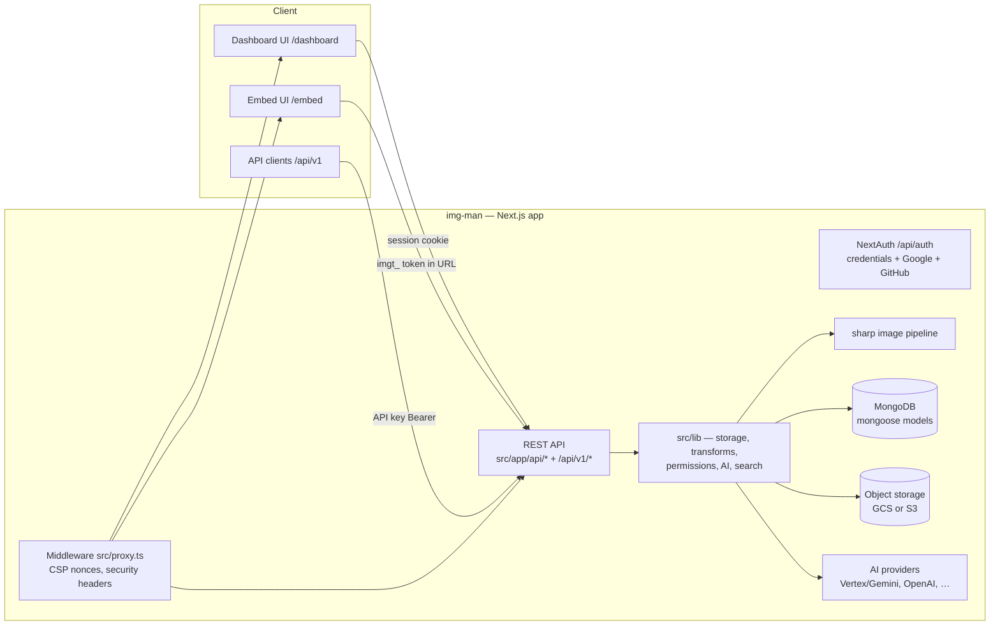

# Architecture

What actually exists in this repository (verified from source, not intent).

img-man is a **single Next.js 16 application** — one deployable unit, no
worker fleet, no queue, no cache tier. Everything else is external
services it talks to.

## Application layer

- App Router under `src/app/`:
  - `dashboard/` — full authenticated UI (assets, designs, PDF tools, AI,
    settings, analytics, playground).
  - `embed/` — chromeless, token-authenticated UI meant for iframing into
    customer products; reuses dashboard components under an embed scope
    context.
  - `i/` and `s/` — asset delivery redirects and share-link pages.
  - `docs/`, `signin/`, `invite/`, `onboarding/` — supporting surfaces.
- `src/lib/` holds all logic: storage drivers, transform URL building,
  folder permission cascades, AI provider adapters, audit, analytics.
- `src/models/` — 24 Mongoose models (asset, folder, user, organization,
  org-membership, design, share-link, api-key, access-token, activity-log,
  …). Mongoose schemas are applied on read/write; there is no versioned
  migration runner for schema changes.

## Authentication

- **Interactive:** NextAuth v4 (`@auth/mongodb-adapter` sessions in
  MongoDB) with credentials (bcrypt), Google, GitHub.
- **Embed:** host app's server mints a short-lived `imgt_` access token via
  `POST /api/v1/auth/token` (API-key authenticated); the iframe receives
  identity, not credentials. See `src/app/embed/dashboard/layout.tsx`.
- **Machine:** API keys under `Settings → API keys`, `Authorization:
  Bearer` on `/api/v1/*`, per-key CORS allowlists, last-used tracking,
  revocation.
- `src/proxy.ts` middleware sets per-request CSP nonces and security
  headers; `next.config.mjs` carries the baseline header set and the
  embed route frame-ancestors override.

## Authorization

Role-based: owner / admin / editor / viewer (`src/lib/permissions.ts`)
with per-section access control, teams and member groups, and folder
cascading access (`src/lib/folder-access.ts`). The embed inherits the
token-named user's role — no separate permission model.

## Data

- **MongoDB** (`src/lib/db.ts`, `mongodb` + `mongoose`): everything
  transactional — orgs, users, folders, assets metadata, designs, share
  links, activity, analytics rollups.
- **Object storage** (`src/lib/storage.ts`): GCS via
  `@google-cloud/storage` and S3-compatible via `@aws-sdk/client-s3`.
  Per-org encrypted BYOC credentials (AES-256-GCM, KEK from
  `GCP_CREDENTIALS_ENCRYPTION_KEY`). Uploads stream client → signed URL →
  bucket; downloads are bucket-direct or proxied per request.

## Image processing & delivery

- `sharp` for thumbnails, EXIF, dominant color, perceptual hash, and
  deterministic transforms keyed by URL params
  (`width/height/format/fit/quality`) — `src/lib/transform-url.ts` and
  `src/lib/transforms/`.
- Named transforms (`?t=thumb`) stored per org.
- Signed public URLs (`/i/...`) with `ASSET_URL_SIGNING_SECRET`.

## AI features

Provider adapters under `src/lib/` (`vertex-ai.ts`, `openai.ts`,
`ai-providers.ts`, feature gating in `ai-feature-access.ts`): generation,
editing, background removal, upscale, OCR, auto-tagging, captions, faces
(`face-clustering.ts`), semantic search embeddings
(`embeddings.ts`). All calls use **the operator's or organization's own
provider keys** — no third-party proxying.

## Background work

No separate worker process. Long-running operations (AI jobs, migrations,
embeddings) run as in-process async jobs recorded in `ai-job` /
`migration-job` collections. `src/instrumentation.ts` handles boot-time
wiring. This is a deliberate simplicity trade-off, documented here so new
contributors do not go looking for a queue.

## Public surfaces

- `/api/v1/*` — REST for integrations (`src/app/api/v1/`).
- `packages/imageman-sdk` — browser SDK for the asset picker embed.
- `packages/imageman-mcp-server` — MCP server exposing the tool registry
  to coding agents.
- `/api/health/live` — liveness (process up, no dependencies).
- `/api/health/ready` — readiness: DB connection, plus storage probe
  unless `HEALTHCHECK_REQUIRE_STORAGE=0`.

## Edition guard

`src/lib/edition/` is the community-edition assertion layer. CI runs
`npm run verify:public-purity` to keep private/commercial surfaces from
being referenced from this repository.
